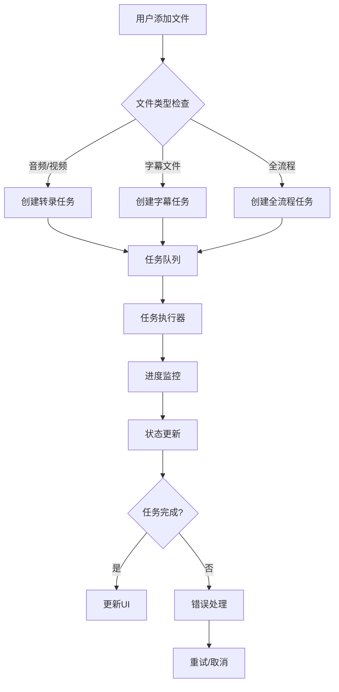
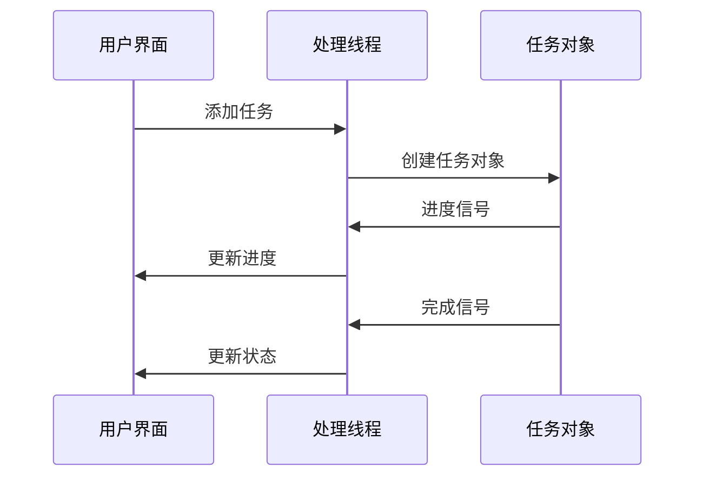

# 批量处理系统设计文档

## 1. 系统概述

批量处理系统是一个用于处理多个视频/音频文件的核心功能模块，支持转录、字幕添加、全流程处理等多种任务类型。

### 1.1 核心组件

- `BatchProcessThread`: 批量处理的核心线程类
- `BatchProcessInterface`: 批量处理的用户界面类
- `BatchTask`: 单个批量任务的数据结构
- `BatchTaskType`: 批量任务类型枚举
- `BatchTaskStatus`: 任务状态枚举

### 1.2 系统流程图



## 2. 任务类型与状态

### 2.1 任务类型

```python
class BatchTaskType(Enum):
    TRANSCRIBE = "批量转录"
    SUBTITLE = "批量字幕"
    TRANS_SUB = "转录+字幕"
    FULL_PROCESS = "全流程处理"
```

### 2.2 任务状态

```python
class BatchTaskStatus(Enum):
    WAITING = "等待中"
    RUNNING = "处理中"
    COMPLETED = "已完成"
    FAILED = "失败"
```

## 3. 核心处理逻辑

### 3.1 任务管理

#### 3.1.1 任务添加

```python
def add_task(self, task: BatchTask):
    self.task_queue.put(task)
    self.current_tasks[task.file_path] = task
    if not self.isRunning():
        self.is_running = True
        self.start()
```

关键点：
- 使用队列管理任务
- 维护当前任务字典
- 自动启动处理线程

#### 3.1.2 任务执行

```python
def run(self):
    while self.is_running:
        running_tasks = sum(
            1
            for task in self.current_tasks.values()
            if task.status == BatchTaskStatus.RUNNING
        )

        if running_tasks < self.max_concurrent_tasks:
            try:
                task = self.task_queue.get_nowait()
                self._process_task(task)
            except queue.Empty:
                time.sleep(0.1)
        else:
            time.sleep(0.1)
```

关键点：
- 控制并发任务数量
- 非阻塞式任务获取
- 任务状态管理

### 3.2 进度监控



关键代码：
```python
def update_task_progress(self, file_path: str, progress: int, status: str):
    for row in range(self.task_table.rowCount()):
        if self.task_table.item(row, 0).toolTip() == file_path:
            progress_bar = self.task_table.cellWidget(row, 1)
            progress_bar.setValue(progress)
            self.task_table.item(row, 2).setText(status)
            break
```

### 3.3 错误处理

```python
def on_task_error(self, file_path: str, error: str):
    for row in range(self.task_table.rowCount()):
        if self.task_table.item(row, 0).toolTip() == file_path:
            status_item = self.task_table.item(row, 2)
            status_item.setText(str(BatchTaskStatus.FAILED))
            status_item.setToolTip(error)
            break
```

## 4. 用户界面设计

### 4.1 界面组件

- 任务类型选择器
- 文件添加按钮
- 任务列表表格
- 进度条
- 状态显示
- 操作按钮（开始、取消、清空）

### 4.2 交互流程


## 5. 性能优化

### 5.1 并发控制

```python
def __init__(self):
    self.max_concurrent_tasks = 1
    self.threads = []
    self.current_tasks = {}
```

### 5.2 资源管理

```python
def stop_all(self):
    self.is_running = False
    for thread in self.threads:
        if hasattr(thread, "stop"):
            thread.stop()
        thread.wait()
    self.threads.clear()
    self.current_tasks.clear()
```

## 6. 扩展性设计

### 6.1 任务类型扩展

系统设计支持轻松添加新的任务类型：
1. 在 `BatchTaskType` 中添加新类型
2. 实现对应的处理逻辑
3. 更新UI支持

### 6.2 文件格式支持

```python
def filter_files(self, file_paths, task_type: BatchTaskType):
    valid_extensions = {}
    if task_type in [
        BatchTaskType.TRANSCRIBE,
        BatchTaskType.TRANS_SUB,
        BatchTaskType.FULL_PROCESS,
    ]:
        valid_extensions = {f".{fmt.value}" for fmt in SupportedAudioFormats} | {
            f".{fmt.value}" for fmt in SupportedVideoFormats
        }
    elif task_type == BatchTaskType.SUBTITLE:
        valid_extensions = {f".{fmt.value}" for fmt in SupportedSubtitleFormats}
```

## 7. 总结

批量处理系统通过多线程、队列管理等技术实现了高效的任务处理。系统具有良好的可扩展性和错误处理机制，同时提供了友好的用户界面。主要特点：

- 支持多种任务类型
- 实时进度监控
- 完善的错误处理
- 友好的用户界面
- 可扩展的架构设计
